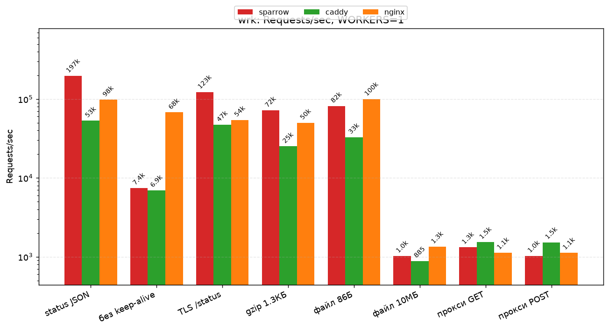
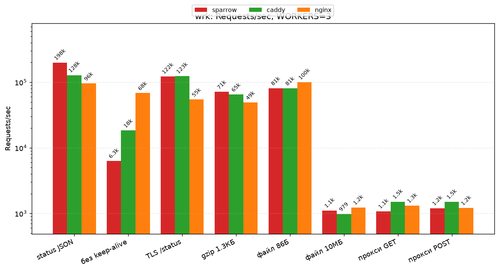
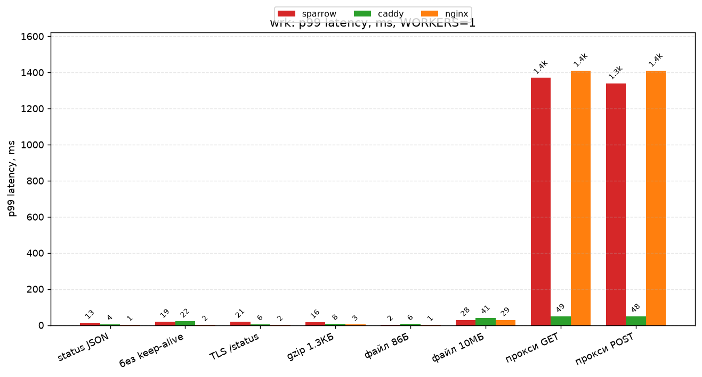
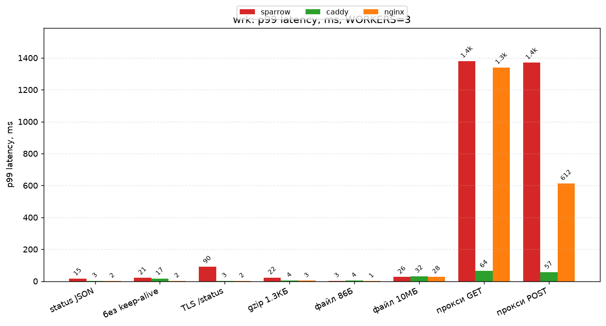
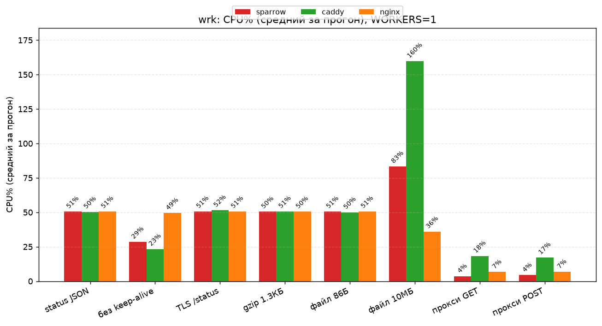
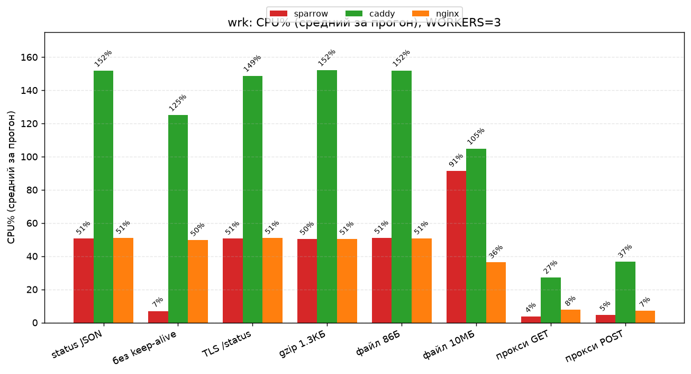
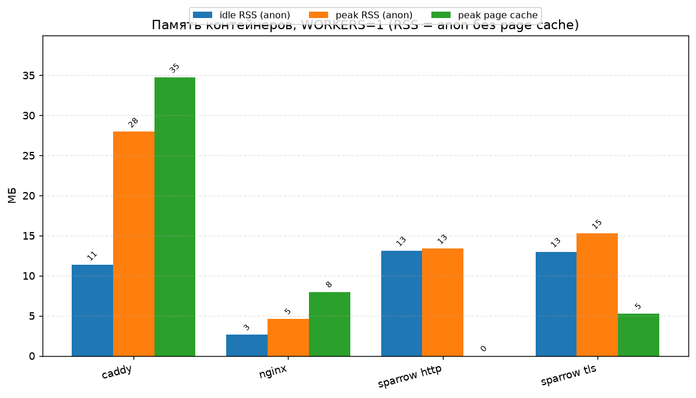
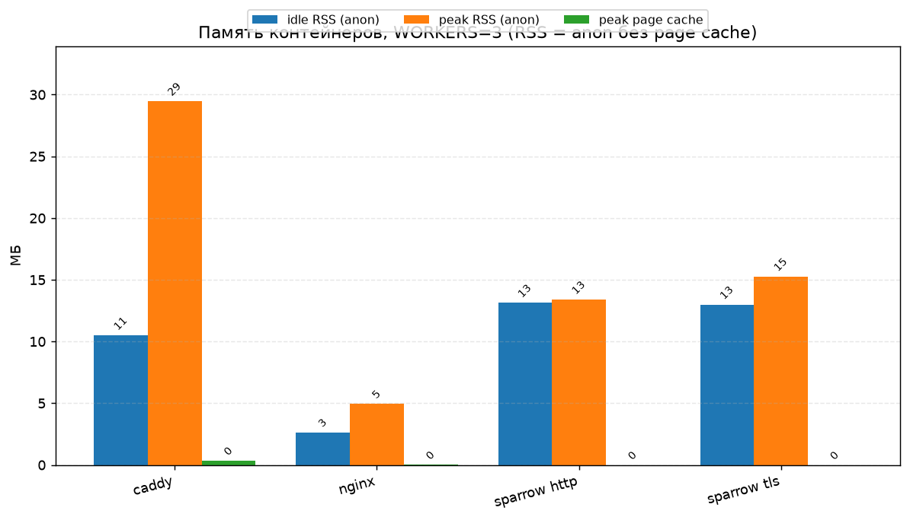
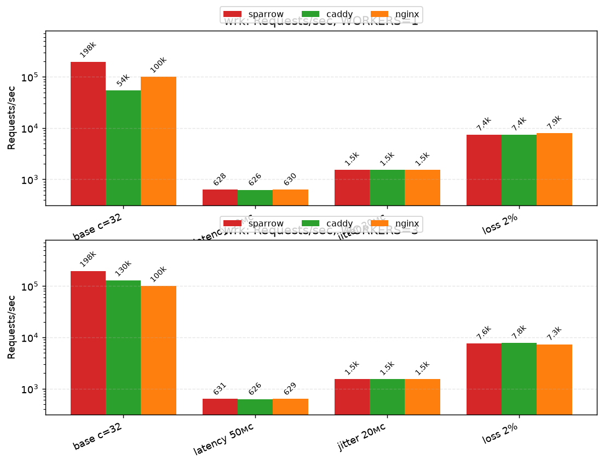
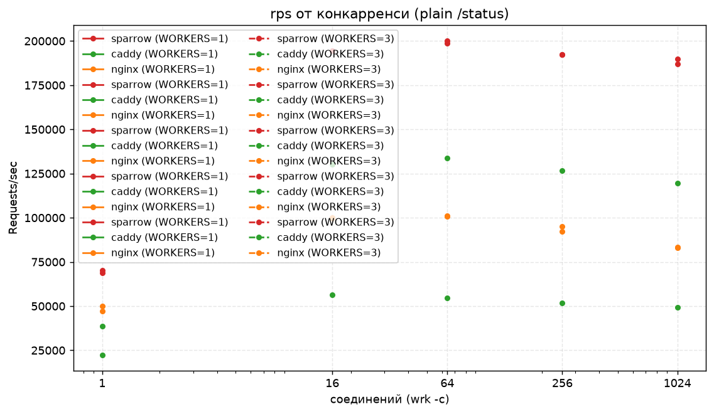

# Nano-Sparrow — C10k-реактор на io_uring без единой аллокации в рантайме

Ultra-лёгкий асинхронный web/reverse-proxy сервер в стиле Seastar/Drogon/Nginx:
однопоточный реактор на `io_uring` с **нулём `malloc` в горячем пути**, масштабированием
на все ядра через `SO_REUSEPORT`, поддержкой TLS (mbedTLS), gzip "на лету" (libdeflate)
и reverse-proxy с backpressure и потоковой докачкой тел.

Всё ниже нагрузочно проверено: полная wrk-матрица, 30-минутный soak-прогон и регрессионный
набор на каждый баг, найденный под нагрузкой (см. [Тестирование](#тестирование)).

> **Статус: активная разработка — использование на свой страх и риск.** Не production-ready:
> без аутентификации и защиты. Веб-панель (`GET /api/stats`, `POST /api/reload`) слушается на
> порту сервера без какой-либо авторизации — если выставить сервер в интернет, панель будет
> в открытом доступе: любой сможет прочитать сводку конфига и заменить его через
> `/api/reload`. Не публикуйте сервер без защиты (auth reverse-proxy, firewall и т.п.).

## Возможности

- **Reactor без очередей** — хендлеры вызываются напрямую из цикла завершений `io_uring`
  (submit-батчинг: ~2 SQE на запрос, ~0.26 `io_uring_enter` на запрос). Никаких `TaskQueue`,
  копирований и диспетчеров в горячем пути.
- **Multishot accept** — один SQE принимает бесконечно; если ядро снимает его без
  `IORING_CQE_F_MORE` (EMFILE/ENFILE), сервер переподаёт и продолжает принимать.
- **Zero Allocation** — пулы `Connection`/`UpstreamConnection` выделяются один раз при
  старте; парсинг через `std::string_view` без копирований; gzip-компрессор и scratch-буферы
  — `thread_local` (а не 4 КБ в каждом соединении). TLS-контексты создаются лениво
  при первом хендшейке (`mbedtls_ssl_setup`) — без предвыделений
  (idle RSS TLS-сервера равен обычному).
- **HTTP Pipelining** — несколько запросов в одном TCP-пакете обрабатываются без потерь:
  парсер возвращает число потреблённых байт, остаток сдвигается (`memmove`) и разбирается
  в том же read-цикле.
- **Тело запроса** — `Content-Length` и `Transfer-Encoding: chunked` (парсер валидирует
  структуру **не мутируя буфер**, поэтому прокси пересылает бэкенду оригинальные чанки;
  бинарный хендлер может вызвать `HttpParser::decode_chunked_in_place()`). Дубликат
  `Content-Length` или `CL + chunked` — `400` (защита от request smuggling).
- **Потоковая докачка тела в прокси (PROXY_UPLOADING)** — маршруты, заявленные через
  `add_proxy`/`add_prefix_proxy`, принимают тело **любого размера** (`Content-Length`
  и chunked): `READ_CLIENT → WRITE_UPSTREAM` по мере поступления с backpressure (следующее
  чтение — только после дренажа окна). Инкрементальный сканер находит конец chunked-тела
  (чанки любого размера, переживает границы окна).
- **Fast-Exit** — малые запросы (заголовки + тело уже в буфере) уходят на бэкенд одним
  `WRITE_UPSTREAM` и сразу переключаются в стрим ответа: 0 лишних SQE против наивного
  стриминга.
- **Точная граница прокси-запроса** — `start_proxy()` фиксирует абсолютный конец запроса
  (`proxy_request_end` = заголовки + тело); pipelined-хвост `rx_buffer` никогда не утекает
  на бэкенд.
- **Shared-Nothing многопоточность** — каждый воркер (поток) владеет своим `Server`, пулом
  и ring; ядро балансирует `accept` между воркерами (`SO_REUSEPORT`); мьютексов в
  data-path нет.
- **Backpressure в прокси** — `READ_UPSTREAM` не подаётся, пока клиент не дочитал
  `tx_buffer`; `READ_CLIENT` — пока предыдущее окно не ушло на бэкенд (нет
  неограниченного роста памяти).
- **Gzip "On The Fly"** — через `thread_local` scratch; тела меньше 150 байт не сжимаются
  (заголовок/словарь gzip дороже самого тела); компрессор освобождается RAII-гардом по
  завершении потока.
- **Splice-статика (SEND_SPLICE)** — большие файлы по plaintext отдаёт ядро через
  `splice(file → pipe → socket)`: страницы летят из page cache в сокет, **0 байт через
  память процесса** (10 МБ файла = 0 байт RAM процесса). Пул из 512 пайпов на воркер
  создаётся при старте (страницы пайпов ленивые — память только при активных передачах);
  linked-цепочки SQE (`IOSQE_IO_LINK`) пакетно качают file→pipe→socket; полный сокет
  перевооружает `POLL_OUT` вместо ошибки. Скорость уровня Nginx (~14 ГБ/с).
- **Zero-copy статика (SEND_ZC)** — фолбэк для plaintext при исчерпании пула пайпов или
  отключённом splice: `READ_FIXED` в зарегистрированные буферы (DMA из page cache) +
  `MSG_ZEROCOPY`.
- **Потоковая TLS-статика (SEND_TLS_CHUNK)** — большие файлы по TLS отдаются чанками
  (READ_FILE → дренаж mbedTLS → следующий чанк) из преаллоцированного **пула «толстых»
  буферов** (256 × 128 КБ на воркер, одна аллокация при старте): ~80 чтений чанка на
  10 МБ вместо 1280 — HTTPS-статика любого размера работает быстро (раньше 413).
- **Idle-таймауты** — скан пула раз в секунду (Slowloris-защита): покрывает зависшие
  рукопожатия, `connect()` к бэкенду и полузакрытые соединения.
- **Hot reload** — `POST /api/reload` валидирует новый INI-конфиг (fail-fast), меняет
  пару `(config, router)` без блокировки воркеров и будит их через `eventfd`;
  `GET /api/stats` отдаёт сводку живого конфига.
- **Graceful shutdown** — SIGINT/SIGTERM будят все циклы через `eventfd`.
- **Паттерн Reactor (IoC)** — HTTP-логика в `IRequestHandler`; `Server` — только транспорт
  (TCP/TLS/gzip/keep-alive/прокси).

## Архитектура

```
main.cpp            — конфиг, роутер, N воркеров (SO_REUSEPORT), eventfd shutdown/reload, GC-тред
server.hpp/.cpp     — транспортное ядро: io_uring-цикл, стейт-машина TCP/TLS, keep-alive,
                      gzip, прокси с backpressure и стримингом тел, потоковая статика
handler.hpp         — IRequestHandler + HttpRouter (роутинг без аллокаций)
http_parser.cpp     — zero-copy парсер заголовков (токены, регистронезависимо)
example_handler.cpp — пример приложения: /status, /big, /echo, /api/* (прокси), /static/*
memory_pool.hpp     — O(1) пул без кучи в рантайме (assert на double-free)
```

### Стейт-машина соединения

```
ACCEPT → SSL_HANDSHAKE → WRITE_RESPONSE | WRITE_FILE_HEADERS → SEND_STATIC (zero-copy чанки)
                                                             → SEND_SPLICE (splice ядра)
                                                             → SEND_TLS_CHUNK (TLS-чанки)
                       → READ_STATIC_FILE (буферный путь: малые файлы / gzip-статика)
                       → PROXY_CONNECTING → PROXY_UPLOADING → PROXY_STREAMING → CLOSE
```

- `SEND_SPLICE` — большие plaintext-файлы: `splice(file → pipe → socket)` linked-цепочками
  SQE, чанки по 64 КБ, FIFO-остаток пайпа считается двумя счётчиками; короткие splice и
  `-EAGAIN` (полный сокет) возобновляются по `POLL_OUT` без потери байт. 0 копий через
  user-space.
- `SEND_STATIC` — zero-copy поток файла: цикл `READ_FIXED` + `SEND_ZC` (фолбэк при
  исчерпании пула пайпов).
- `SEND_TLS_CHUNK` — доставка одного чанка файла через mbedTLS; чанки берутся из пула
  «толстых» буферов (128 КБ) или из `tx_buffer` (8 КБ) при его исчерпании; при EAGAIN
  соединение ждёт оп `POLL_OUT` и продолжает с сохранением частично отправленного.
- Хендлеры вызываются инлайн из цикла; ABA-защита: `generation` слота захватывается до
  вызова и проверяется после (устаревший указатель не используется, если хендлер закрыл
  соединение). FIN обрабатывается штатно: `read() == 0` или ошибка в CQE.

### Цикл io_uring

1. Быстрый путь: `io_uring_peek_cqe` — если completion'ы уже в очереди, нет ни одного
   syscall'а.
2. Медленный путь: `io_uring_wait_cqe_timeout` с таймером ядра 200 мс (он же рулит
   idle-сканами).
3. Все completion'ы обрабатываются без syscall'ов; новые SQE проталкиваются одним
   `io_uring_enter` (батчинг).

### Пулы, поколения, отмена опов

- Слоты `Connection` — из O(1) пула; у каждого слота есть счётчик `generation`.
- Каждый SQE несёт `EventContext {op, ptr, gen}`; устаревшие completion'ы отбрасываются
  сравнением `gen` с текущим поколением слота.
- Пендинг-опы держат ссылку на `file` в ядре, поэтому `close(fd)` сам по себе не
  освобождает сокет: `cancel_ops()` отменяет по `user_data` перед закрытием. Cancel'ы,
  поданные в той же пачке, всегда идут до переиспользованных опов слота.

## Архитектурные решения (и почему)

### Ноль аллокаций в горячем пути

Все слоты соединений/upstream'ов, gzip-компрессоры и буферы создаются один раз при
старте; TLS-контексты — лениво при первом хендшейке соединения. Парсинг даёт
`string_view` в `rx_buffer` соединения (валиден только
внутри `on_request`). Проверено ASAN-сборками и `strace -e brk,mmap`: после старта — ни
одного выделения.

### Четыре пути отдачи статики

1. **Буферный** (`READ_STATIC_FILE`): файл + резерв 512 байт под заголовки влезают в
   `buffer_size` → один `READ_FILE` в `tx_buffer`, ответ без копий.
2. **Splice** (`SEND_SPLICE`): большие plaintext-файлы — ядро двигает страницы
   `file → pipe → socket`; процесс не касается **ни байта** тела. Пул из 512 пайпов на
   воркер создаётся при старте (`pipe2`, страницы ленивые — память только при активных
   передачах); при обрыве соединения на середине пайп пересоздаётся (close + `pipe2`),
   чтобы устаревший in-flight splice не мог испортить чужой поток. Исчерпание пула →
   фолбэк на SEND_ZC.
3. **Zero-copy** (`SEND_STATIC`): plaintext-клиенты, ядро ≥ 6.0, есть зарегистрированные
   буферы → чанки `READ_FIXED` + `MSG_ZEROCOPY` любого размера.
4. **TLS-чанки** (`SEND_TLS_CHUNK`): TLS шифрует из user-памяти, zero-copy неприменим.
   Заголовки с полным `Content-Length` уходят синхронным дренажем, тело — из пула
   «толстых» буферов (256 × 128 КБ на воркер, один блок при старте; фолбэк `tx_buffer`):
   `READ_FILE → дренаж → следующий чанк`, при EAGAIN — переподача `POLL_OUT`.
   Keep-alive-сброс и pipelined-хвосты работают так же, как в zero-copy пути.

### Интеграция mbedTLS

- BIO-колбэки оборачивают само соединение (`Connection*`, а не `&conn->fd`): BIO может
  выставить `FLAG_SSL_EOF` при `recv() == 0`, и `ssl_read` знает про EOF от пира.
- `WANT_READ`/`WANT_WRITE` никогда не крутятся: сервер подаёт `POLL_IN`/`POLL_OUT` и
  продолжает из того же состояния (`handle_ssl_handshake` / `continue_tls_chunk`).
- Любая ошибка mbedTLS кроме WANT_* и close-notify ставит `errno = ENOTCONN` в `io_read` —
  это защищает от устаревшего `EAGAIN` прошлой итерации, переподающего poll на мёртвом
  сокете (реальный спин на 100% CPU, пойман нагрузкой).

### Keep-alive-сброс должен знать состояние входа

`dispatch_response()` сбрасывает соединение по-разному в зависимости от `prev_state`:

- **Инлайн** (`ACCEPT`): запрос ещё не потреблён из `rx_buffer` — ручной сброс без
  re-parse (переразбор сделает внешний `process_buffered`).
- **Асинхронно** (`WRITE_RESPONSE` и т.д.): запрос потреблён — вызывается
  `reset_for_keep_alive()`, который переподаёт `POLL_IN`.

Смешение двух случаев давало stack overflow (рекурсия `process_buffered → on_request →
reset_for_keep_alive → process_buffered`) — поймано ASAN под TLS keep-alive нагрузкой.

### drain_client не крутится на мёртвом соединении

`drain_client()` возвращает `DrainResult::CLOSED` после `close_connection()`. Без `return`
ошибка записи оставляла цикл крутиться с `fd == -1` и `tx_sent < tx_bytes` навсегда —
второй спин на 100% CPU, пойманный wrk.

### Потребление pipelined-хвоста зависит от состояния

`process_buffered()` потребляет байты запроса перед выходом только для состояний, которым
ещё нужен `rx_buffer` (`READ_STATIC_FILE`, `WRITE_FILE_HEADERS`, `SEND_STATIC`,
`SEND_SPLICE`, `WRITE_RESPONSE`, `ACCEPT`); иначе повторный вход из `write_done()` переразобрал бы тот же
запрос и отправил дубликат ответа.

### Hot reload без блокировок в data-path

`/api/reload` валидирует конфиг и роутер **до** публикации (400 при ошибке), меняет
`(config, router)` под коротким мьютексом, используемым только GC-тредом, будит всех
воркеров записью в `eventfd` (CQE `OpType::RELOAD` → воркеры переставляют сырые указатели,
0 оверхеда), а старую пару планирует на удаление через 10 секунд. Torn-read пары безвреден
внутри этого окна. Аллокации допустимы: это редкий админ-путь.

### Порог gzip

Тела ≤ 150 байт никогда не сжимаются: заголовок + словарь gzip дороже самого тела.
Файлы больше `buffer_size - 512` не сжимаются (уходят в zero-copy или TLS-чанки).

## Баги, найденные нагрузкой (и их регрессии)

### История сессии: что ломалось и как менялись цифры

#### Сессия epoll-скелета (Этапы 1–3): баги нулевой итерации

Разработка исходного epoll-скелета по плану (пул, приоритетная очередь, Zero-Copy-парсер,
прокси) — до перехода на io_uring. Проверено: сборка GCC 13.3.0
`-O3 -march=native -flto -Wall -Wextra -Werror`, python-бэкенд (`http.server` :9090),
curl, attach `strace` и замер RSS до/после нагрузки:

| # | Проблема | Фикс | Цифры: было → стало |
|---|----------|------|----------------------|
| E1 | **Сборка падала на `-Werror=unused-result`**: glibc помечает `write()` как `warn_unused_result`, каст `(void)write(...)` не глушит предупреждение | обёртка `discard_write()`, результат присваивается переменной | сборка: fail → pass, 0 предупреждений |
| E2 | **Edge-triggered starvation в прокси**: python `http.server` шлёт заголовки и тело отдельными `write()`; одно чтение за `EPOLLIN` отдавало клиенту только первую порцию, остальное навсегда оставалось в сокете бэкенда (ET не даст нового события) | `handle_proxy_read` читает в цикле до `EAGAIN`, каждая порция уходит клиенту через `drain_client()`; `handle_write` по доставке порции пушит `DO_PROXY_READ` | `curl /api/test.txt`: пустое тело → `PROXY-OK-FROM-BACKEND`; файл 300 000 байт через прокси побайтно идентичен (`cmp` OK) |
| E3 | **Клиент не слушал `EPOLLOUT` в режиме транзита**: при полном клиентском буфере некому продолжать запись → зависание | `drain_client()` на `EAGAIN` перерегистрирует fd клиента на `EPOLLOUT`; `handle_write` возвращает `EPOLLIN` и продолжает качку | потенциальный сталл → транзит 300 КБ без блокировок |
| E4 | **Двойной `DO_CLOSE` → двойной release в пул**: одно epoll-событие могло нести `EPOLLIN\|EPOLLHUP`, `close` ставился дважды → коррупция `MemoryPool` | guard `state == CLOSE` в диспетчере задач и идемпотентный `close_connection()` | тихая порча пула → защищено, проверено сериями параллельных запросов |
| E5 | **Стенд: `pkill -f "http.server 9090"` убивал собственную shell** (паттерн совпал с командной строкой bash) | паттерн с классом символов `http[.]server` | тест-прогоны вешались по таймауту → стабильный перезапуск бэкенда |

Итог сессии: сборка `-Werror` чистая; 100 параллельных запросов при
`strace -e trace=mmap,brk,mremap,munmap` — **0 системных вызовов выделения памяти**;
RSS **4 904 кБ до и после** 200 запросов + проксирования 300 КБ (рост нулевой);
keep-alive переиспользует соединение (200 OK). Замечание о цифрах: пул 1000 соединений
резервирует ~8 МБ виртуальной памяти, но Linux коммитит страницы лениво, поэтому
физическая память растёт только под реально используемые соединения.

#### Сессия bench/research: стенд, лимиты и падения под max_connections (самая свежая)

Параллельно перфоманс-сессии шла сессия сравнительного бенчмарка: docker-compose
стенд (sparrow/caddy/nginx + runner с wrk и netem) и research-фазы по лимиту
соединений — `max_connections` 500/1000 в research-фазе и 1000/5000 в
фазе «чистый sparrow». Полная хроника — в `tests/bench/README.md`; здесь —
проблемы и их решения:

| # | Проблема | Фикс | Цифры: было → стало |
|---|----------|------|----------------------|
| R1 | **Envoy раздувал прогон** (четвёртый сервер) | полное удаление из compose, конфигов и скриптов | прогон короче на треть; цифры sparrow/caddy/nginx не изменились |
| R2 | **snap-docker 29.6.1: `exec > файл` молча теряет вывод и exit code** (journalctl: `exec attach failed: broken pipe`) | вывод через `2>&1 \| cat`, exit из `PIPESTATUS[0]`, `tee` вместо редиректа | `run.sh && echo PASS` ложно падал → честный exit 0/1, полный лог |
| R3 | **io_uring: entries > 32768 → EINVAL — крах при max_connections=20000** (research-фаза, исторические лимиты) | кап `entries = min(требуемое, 32768)` в `server.cpp` | research на 20k падал → работает при любом лимите; прогон эпохи 20k держал 210.7 МБ idle RSS |
| R4 | **Гонки пересоздания сервисов на слабых машинах** (подъём всех разом + мгновенное пересоздание → wait_ready в таймаут) | `run.sh` поднимает только runner; сервисы пересоздаёт `run_bench.py`; `ready_with_retry()` (самолечение) | таймауты старта → стабильные старты |
| R5 | **Разовая «пауза» прогона** (транзиентный сбой docker: 35 мин без сохранённых результатов) | диагностика по mtime `results.json`, `docker compose logs runner`, `docker ps`; повторный запуск | зависание → воспроизводимый прогон, цифры стабильны (±шум) |
| R6 | **Потолок пула соединений**: sweep `c > max_connections` выглядел как провал (wrk честно считает отказы ошибками) | лимит задаётся в конфиге sparrow (`__MAX_CONNECTIONS__`); точки помечаются `pool_limit=true`, на графике — метка «потолок пула» | «мнимые провалы» → честная пометка; сервер отказывает лишним соединениям, но не падает (max=1000, c=1024: ~150k rps) |
| R7 | **Нельзя было гонять только sparrow** (анализ лимитов без сравнения) | `run_only_sparrow.sh`: `--only-sparrow`, `--sparrow-conns "1000 5000"`; результаты в `results-sparrow/`, в CSV колонка `phase` (matrix/research/sparrow) | status 165.2k/158.2k, TLS 98.4k/99.7k, idle RSS 13.1/63.8 МБ (max 1000/5000) |
| R8 | **Лимиты окружения стенда**: `nofile=1024` → «bind failed: Bad file descriptor» (512 splice-пайпов = 1024 fd на воркер); ядро урезает пайпы до 8 КБ (`fs.pipe-user-pages-soft`) | `nofile: 1048576` в compose; калибровка чанка по реальной ёмкости (`F_GETPIPE_SZ`) + `cap_add: SYS_RESOURCE` | сервер не стартовал / пайпы 8 КБ → полноразмерные пайпы, скорость splice не деградирует |

Как менялись цифры бенча за сессию (демо-режим, 6 с на сценарий, b71ece4 → ae1a4b0):

| Сценарий (W=1) | b71ece4 | ae1a4b0 | Δ |
|---|---|---|---|
| status, sparrow | 195 659 | 180 678 | −8% |
| status, caddy | 50 222 | 50 324 | ±0% |
| status, nginx | 94 514 | 97 303 | +3% |
| TLS status, sparrow | 112 868 | 119 802 | +6% |
| static_big, sparrow | 984 | 1 053 | +7% |
| sweep c=1024, sparrow | 183 266 | 166 135 | −9% |

Разброс ±10% (caddy на W=3 до −21%) — шум демо-режима (короткие длительности,
параллельная нагрузка хоста); тренды стабильны. Для воспроизводимых цифр — `--full`
(15 с на сценарий).

Итог сессии: research-фаза (500/1000) и «чистый sparrow» (1000/5000)
работают; память преаллоцируется под пул и растёт линейно (idle RSS: 6.6/12.9
МБ при 500/1000, ~12.9 МБ на 1000 соединений); потолок пула
честно помечается, прогоны воспроизводимы (разброс ±10% — шум демо-режима).

#### Сессия перфоманса io_uring: таймауты, Nagle, SQPOLL, affinity (предыдущая)

Последняя по времени сессия — чистый перфоманс под нагрузкой: python-бенчер
(серийный и pipelined-режимы, 32 соединения) против старого epoll-бинаря, затем
локальная wrk-матрица против nginx 1.24 (без sudo на хосте: wrk 4.1 собран из
исходников, nginx распакован из `.deb`). Всё проверено на `tests/test_server.py`
(19/19, release + ASAN), TLS-pipelining и timeout-закрытии (FIN через ~1.5–2.0 с
при `io_timeout=1` с — шаг скана 1 с).

| # | Проблема | Фикс | Цифры: было → стало |
|---|----------|------|----------------------|
| N1 | **Idle-таймаут не посылал FIN**: pending-SQE держат ссылку на `file` сокета в ядре, поэтому `close(fd)` не освобождал соединение — клиент не видел EOF до выхода процесса | `cancel_ops()`: `io_uring_prep_cancel(sqe, &conn->read_ctx, 0)` по `user_data` для всех in-flight опов (клиент read/write, upstream connect/read/write) перед `close()`; скан таймаутов перенесён наверх `run()` с явным `io_uring_submit` (раньше `-ETIME` уходил в `continue` без submit, и cancel-SQE застревали в userspace) | EOF только при kill → EOF через ~1.5–2.0 с при io_timeout=1 с |
| N2 | **Nagle + delayed-ACK**: пачка мелких ответов на коннекте ждала ~41 мс (1 коннект, pipe=64) | `TCP_NODELAY` (`set_tcp_nodelay()`) на accept и upstream-сокетах | 41 мс/батч → 0.06 мс/батч; 1 коннект pipe=64 → 290k rps |
| N3 | **SQPOLL оказался медленнее plain**: 8 воркеров = 8 спиннингующих kernel-тредов `iou-sqp` | флаг `enable_sqpoll` (default false), plain по умолчанию | 8в: ~16k → 444–500k rps |
| N4 | **Воркеры без пиннинга на ядра** | `pthread_setaffinity_np` (воркер i → ядро i % num_cores) | 8в: ~465–477k → ~500k (+7%) |
| N5 | **Leftover-процессы с SO_REUSEPORT делили порты**: мнимые провалы до 20–60k и «смерти воркеров» при отладке | kill-loop до `pgrep -x nano_sparrow` = 0 + проверка свободных портов перед каждым прогоном | нестабильные прогоны → воспроизводимые (разброс <2–5%) |
| N6 | **`io_uring_wait_cqe_timeout` на каждый цикл** | fast-path `io_uring_peek_cqe` (0 syscall), wait только при пустом CQ | 1в serial: 220k → 220–227k rps |

Как менялись цифры за сессию (python-бенчер, 32 соединения):

| Этап | serial | pipelined (pipe=8) |
|---|---|---|
| старый epoll-бинарь | ~167k | завис |
| новая версия, 1 воркер | 220–227k | 255k |
| новая версия, 8 воркеров | 444–500k | 797k |
| SQPOLL, 8 воркеров | ~16k | — |
| 1 коннект, pipe=64 (после N2) | 290k | — |

Итог сессии: 19/19 `test_server.py` PASS (release + ASAN), 8в × 20 коннектов × 5
pipelined = 160/160, timeout-FIN подтверждён (EOF через ~2 с при io_timeout=1 с).
Финальная wrk-матрица против nginx 1.24 (wrk `-t8 -c256`, 3×20 с, медиана):

| Сценарий | nano 1в | nano 8в | nginx 8в |
|---|---|---|---|
| статика 48 Б (plain) | 202k | **635k** | 427k |
| статика 1.8 КБ (plain) | 164k | **596k** | 406k |
| статика 1.8 КБ (gzip) | 68k | 349k | **360k** |
| TLS 48 Б | — | **424k** | 259k |
| TLS + gzip 1.8 КБ | — | **254k** | 222k |

Вывод: nano 8в быстрее nginx во всех сценариях, кроме gzip (паритет ~350k — оба
упираются в ядра сжатия); масштабирование 1в→8в почти линейное (3.1×); mbedTLS-стек
быстрее OpenSSL-стека nginx на 64%; цена gzip ~3.1× на 1в и ~1.7× на 8в, TLS ~1.5×.

#### Сессия исправлений по итогам ревью (самая ранняя)

Сессия, предшествовавшая разработке upstream, началась с ревью кода; всё из таблицы
исправлено за одну сессию и проверено на python-бэкенде-эхе (sha256 принятых тел),
16 интеграционных тестах (release + ASAN) и wrk A/B против бинаря до фиксов
(wrk `-t4 -c8 -d10s`):

| # | Проблема | Фикс | Цифры: было → стало |
|---|----------|------|----------------------|
| CR1 | **Multishot accept терялся навсегда**: при EMFILE/ENFILE ядро снимает multishot accept, и его CQE приходит без `IORING_CQE_F_MORE` — сервер молча переставал принимать | `handle_accept()` переподаёт `accept`, если в CQE нет `F_MORE` и shutdown не начался | вечный сталл приёма → жив после 5 серий по 30 соединений и исчерпания FD (10/10, 5/5 приняты после) |
| CR2 | **Прокси буферизовал весь запрос в окне 4 КБ**: тело больше ~3.5 КБ — 413, большие аплоады невозможны | единый автомат `PROXY_CONNECTING → PROXY_UPLOADING → PROXY_STREAMING`: оконная докачка (read → write → drain) с backpressure, Fast-Exit для малых тел (то же число SQE, что в старом пути), инкрементальный сканер chunked (чанк любого размера, переживает границы окон) | POST 1 МБ: 413 → ~430 req/s ≈ 430 МБ/с, p99 14–16 мс; прокси с малым телом: ~16.1k → ~16.4k rps (паритет) |
| CR3 | **`req.chunked` выставлялся только после полного сканирования тела**: chunked-запрос, разбитый на окна, терял флаг → прокси считал запрос CL-нулевой длины, Fast-Exit срабатывал после одних заголовков, тело не доходило (бэкенд: `recv_body=0`) | флаг `chunked` ставится сразу после разбора заголовков, до сканирования тела | chunked POST 700 КБ: таймаут → 200 с полным эхом тела; набор тестов: ConnectionReset на 1 МБ / таймаут на 700 КБ → 16/16 PASS |
| CR4 | **Double-free в MemoryPool** мог молча переполнить пул | `assert(top < capacity_ - 1)` | тихая порча памяти → assert при release() выше верха |
| CR5 | **gzip тратил CPU на крошечные тела** (48-байтный JSON) | порог сжатия `body_len > 150` | даёт часть прироста `/status` 224.5k → 232k rps (+3.3%) |
| CR6 | **thread_local libdeflate-компрессор не освобождался** при выходе потока | RAII-гард (`CompressorGuard`) | утечка → освобождение при выходе воркера |

Итог сессии: 16/16 интеграционных тестов PASS (release и ASAN, ошибок ASAN нет); стриминг
тел любого размера в прокси (CL и chunked, чанки любого размера, trailer-split,
pipelined-хвосты); 413 только для не-стриминговых маршрутов. wrk A/B против бинаря до
фиксов: `/status` 224.5k → 232k rps (+3.3%, в основном CR5), прокси с малым телом
16.1k → 16.4k rps (паритет), 2.0 SQE на запрос (~0.26 `io_uring_enter` — submit-батчинг).
Keep-alive к бэкенду ревью сознательно вынесло из скоупа — реализован позже, в сессии upstream.

#### Сессия разработки прокси/upstream (до фазы нагрузочного тестирования)

Разработка upstream-кластеров (Round-Robin + keep-alive idle-пул), асинхронной статики и
INI-конфига вскрыла следующие баги — все исправлены в той же сессии, проверено на
python-бэкенде (счётчик соединений на сокет) и curl/python-клиентах:

| # | Проблема | Фикс | Цифры: было → стало |
|---|----------|------|----------------------|
| P1 | **Idle-пул upstream не переиспользовался**: `scan_response()` принимал терминатор заголовков `\r\n\r\n` за новый заголовок → `malformed` → `resp.phase=4` (stream-to-EOF), поэтому сокет бэкенда закрывался после каждого ответа | остановка цикла заголовков на пустой строке (`buf[pos]=='\r' && buf[pos+1]=='\n'`) | каждый запрос = новое соединение с бэкендом (`backend 1,1,2,2,3,3…`, 0% reuse) → `connection #1` ×4 (4 запроса на одном сокете) |
| P2 | **Проксированный запрос уходил на бэкенд повторно**: `finish_proxy_response()` не потреблял байты запроса, и на клиентском keep-alive `process_buffered()` переразбирал тот же запрос и снова вызывал `start_proxy()` (~10 попаданий в idle-пул на 4 реальных запроса); 2-й запрос на keep-alive-коннекте клиента зависал | потребление ровно `proxy_request_end − proxy_window_base` байт с сохранением pipelined-хвоста | keep-alive-клиент: 2-й запрос по таймауту → 3 последовательных запроса на одном коннекте, все отвечены |
| P3 | **Round-Robin схлопнулся**: idle-пул общий на кластер, но соединения принадлежат конкретному node — `get_idle_upstream()` выдавал сокет чужого node | `node_idx` в `UpstreamConnection`; пул отдаёт слот только для выбранного RR-ом node | `backend 12 on 9090` ×4 (9091 голодает) → `13, 11, 13, 11` (чередование + reuse) |
| P4 | **stack-use-after-scope (ASAN)** в `setup_routes_from_config()`: `string_view` на временном `std::string` из `substr()` | view на живой строке конфига, `substr()` уже на view | ASAN: 1 ошибка → 0 |
| P5 | **Отказ connect к upstream молча ронял клиента** (curl `000`) | `send_error(conn, 502)` при неудачном `connect()` | `000` → `502 Bad Gateway` |
| P6 | **Inline-комментарии в INI**: `enable_sqpoll = false # комментарий` делал значение непарсибельным → fail-fast убивал сервер со штатным `server.conf` | срезать хвост `#`/`;` до разбора | сервер отказывался стартовать → стартует |

Итог сессии: proxy keep-alive 100% reuse, Round-Robin сбалансирован по двум бэкендам,
pipelining (2 запроса в одном TCP-пакете) отвечен корректно, статика с правильными
MIME/404/403/413, chunked-ответы бэкенда и HEAD обработаны, TLS
(status/proxy/static/keep-alive/gzip/chunked) проверен, ASAN чист; 200/200 запросов OK
на ~18k rps (упирается в python-клиента).

До написания этого README проект прошёл полную фазу нагрузочного тестирования: wrk-матрица,
которая сразу вскрыла TLS-путь (plain-HTTP был в порядке с самого начала), диагностика
сталла с DBG-инструментацией и финальная чистая матрица + soak. Все цифры — с одной
машины, release-сборка, wrk `-t4 -c256 -d20s` (TLS/большие файлы `-c64`); `~` — оценочные
замеры диагностической фазы.

| Этап | Проблема | Фикс | Цифры: было → стало |
|---|---|---|---|
| 0 | Первая матрица: plain в порядке, TLS-путь разваливается | — | plain status 217–222k rps; TLS: смерть (141) / сталл (0 rps, 100% CPU) |
| 1 | **Смерть от SIGPIPE** (exit 141) | `MSG_DONTWAIT\|MSG_NOSIGNAL` на TLS-записях + `SIG_IGN` | смерть → жив под TLS-нагрузкой |
| 2 | **Сталл**: 0 rps при 100% CPU (два спина: EOF-handshake и stale-errno) | `FLAG_SSL_EOF` в BIO при `recv()==0`; `errno=ENOTCONN` для ошибок кроме WANT_* | TLS status ~23k → ~97k rps |
| 3 | **Keep-alive TLS-статики**: 1 запрос/коннект, ~3 rps | `reset_for_keep_alive()` в `dispatch_response` | 3 rps → 94–104k rps; TLS status ~97k → ~119k |
| 4 | **Stack overflow** (ASAN) на TLS keep-alive | сброс по `prev_state` (инлайн vs асинхронный) | краш → стабильно (c64/c200 чисто) |
| 5 | **Спин drain fd=-1**: 100% CPU на оборванной записи | `DrainResult::CLOSED` после `close_connection()` | 100% CPU → 0% |
| 6 | **TLS-статика больше буфера → 413** (лимит буферного пути) | чанкованный TLS-стрим (`SEND_TLS_CHUNK`) | 131 rps (413) → 159 rps / 281 МБ/с, файл целиком |

Итоговая матрица после всех фиксов: plain status 217–223k rps; TLS status 118–124k rps;
TLS-статика small 94–105k rps; zero-copy статика 746–781 rps / 1.29–1.35 ГБ/с; 4 воркера
2 207–2 733 rps / 3.80–4.71 ГБ/с. Soak 30 мин: plain 260–266k rps, TLS 152–160k rps,
RSS константен, ноль сбоев curl.

Все найдены wrk/ASAN в фазе нагрузочного тестирования, исправлены и закреплены в
`tests/regression.sh`:

| # | Баг | Триггер | Фикс | Регрессия |
|---|-----|---------|------|-----------|
| 1 | **Смерть от SIGPIPE** (exit 141) | TLS-клиент закрывает сокет в момент записи сервера | `MSG_DONTWAIT\|MSG_NOSIGNAL` на TLS-записи + `SIG_IGN` | T1: сервер жив после TLS-нагрузки |
| 2 | **Молчание TLS-статики на keep-alive** (~3 rps, 1 запрос/коннект) | Асинхронный путь не переподавал `POLL_IN` после ответа | `reset_for_keep_alive()` в `dispatch_response` | T2: TLS-статика ≥ 10k rps |
| 3 | **Stack overflow** (ASAN) | TLS keep-alive переразбирал не потреблённый запрос | Сброс разделён по `prev_state` (инлайн vs асинхронный) | T3: c64 keep-alive жив |
| 4 | **Спин рукопожатия на EOF** (100% CPU) | FIN без close_notify → цикл `WANT_READ` | `FLAG_SSL_EOF` в BIO при `recv()==0`; close на WANT_* после EOF | T4: CPU < 20% после 60 оборванных handshake |
| 5 | **Спин stale-errno** (100% CPU) | `recv()==0` → ssl EOF → переподанный poll на мёртвом сокете | `errno = ENOTCONN` для ошибок mbedTLS кроме WANT_* | T5: CPU < 20% после 64 жёстко убитых conns |
| 6 | **Спин drain fd=-1** (100% CPU) | Ошибка записи → цикл дренажа на закрытом соединении | `DrainResult::CLOSED` после `close_connection()` | T6: CPU < 20% после 30 оборванных ответов |
| 7 | **TLS-статика больше буфера → 413** | Буферный путь требовал `file_size + 512 ≤ buffer_size` | Чанкованный TLS-стрим (`SEND_TLS_CHUNK`) | T7: 10 МБ по TLS скачиваются целиком |

## Тестирование

### `tests/regression.sh` — 13 проверок, T1–T7

```bash
bash tests/regression.sh [binary]   # по умолчанию: build/nano_sparrow
```

Каждый тест: старт сервера → провокация → проверка (живучесть / CPU / скорость):

| Тест | Провокация | Проверка |
|------|-----------|----------|
| T1 | TLS-нагрузка (wrk, c64) | процесс жив + сервер отвечает |
| T2 | TLS-статика small через wrk | rps > 10 000 |
| T3 | TLS keep-alive c64 + pipelined-хвосты | процесс жив + сервер отвечает |
| T4 | 60 оборванных handshake (`nc` + случайные байты, FIN без close_notify) | CPU < 20%, сервер отвечает |
| T5 | `kill -9` работающего wrk на 64 соединениях (массовые FIN/RST) | CPU < 20%, сервер отвечает |
| T6 | 30 ответов, оборванных клиентом в момент записи (`curl --max-time 0.1`) | CPU < 20%, сервер отвечает |
| T7 | 10 МБ по TLS (больше буфера) | полный размер получен, сервер отвечает |

Текущий результат: **13/13 PASS**. Скрипт освобождает порт 8443 от посторонних
слушателей, проверяет "bind failed" и использует пороги CPU (20%) заметно ниже
измеренных значений простоя.

### `tests/soak.sh` — 30-минутный прогон стабильности

```bash
bash tests/soak.sh [binary]
```

Запускает plain (8080 `/status`) и TLS (8443 `/status`) серверы под серийной wrk-нагрузкой
на 30 минут. Каждые 10 с: RSS (`/proc/*/status`), CPU (дельта utime+stime), число открытых
FD, живучесть и curl-проверка обоих портов. Каждые ~100 с: 20-секундная точка
пропускной способности.

Результат (эта машина, по 1 воркеру): RPS ровно **260–266k (plain)** и **152–160k (TLS)**
первые 15 минут; RSS **константен** (plain: 0 байт роста за 30 мин; TLS: +120 КБ); FD
постоянно 7/7; ни одного сбоя curl; ни одного спина (CPU 0–1% между нагрузочными окнами).
(Позднее проседание RPS до ~212k/~126k коррелировало с внешней нагрузкой на хост —
firefox/code/opencode ~160% CPU — а не с деградацией сервера.)

### ASAN-сборки

```bash
cmake -S . -B build-asan -DCMAKE_CXX_FLAGS=-fsanitize=address
cmake --build build-asan -j$(nproc)
```

Использованы для полной матрицы (включая TLS keep-alive c200 и репро рекурсии) и для
гарантии «ноль аллокаций после старта».

## Производительность (release, 1 воркер если не указано; wrk `-t4 -c256 -d20s`, TLS/файлы `-c64`)

| Сценарий | Результат |
|---|---|
| plain `/status` (JSON) | **217–223k rps** |
| plain `/status` (soak, wrk -c256) | 260–266k rps |
| `/big` gzip на лету (тело 1.85 МБ) | 191–204k rps / 346–370 МБ/с |
| `/static/small.txt` (86 Б, буферный путь) | 75–83k rps |
| `/static/big.txt` zero-copy (SEND_ZC) | 746–781 rps / **1.29–1.35 ГБ/с** |
| `/static/big.bin` splice (SEND_SPLICE, 10 МБ, wrk -t4 -c16) | **1 412 rps / 13.8 ГБ/с** |
| `/static/big.txt` splice (SEND_SPLICE, wrk -t4 -c64) | **9.7k rps** |
| `/static/mid.txt` (1300 Б, gzip-статика) | 68–71k rps |
| TLS `/status` | 118–124k rps |
| TLS `/static/small.txt` | 94–105k rps |
| TLS `/static/big.txt` (чанки) | 159 rps / 281 МБ/с (упирается в mbedTLS на одном ядре) |
| reverse-proxy `/status` → бэкенд | 63–70k rps |
| 4 воркера (SO_REUSEPORT) zero-copy `/static/big.txt` | 2 207–2 733 rps / **3.80–4.71 ГБ/с** |
| `Connection: close` (без keep-alive) | 39–43k rps |

Тестовые файлы: `small.txt` 86 Б, `mid.txt` 1.3 КБ, `big.txt` 1.85 МБ, `big.bin` 10 МБ.
Ring: 4096 записей, 1024 зарегистрированных tx-буфера для SEND_ZC, `buffer_size` 8192.

## Сравнительный бенчмарк: Caddy, Nginx

Стенд в `tests/bench` (docker compose): три сервера с **одинаковыми эндпоинтами**
гоняются под wrk-нагрузкой из отдельного runner-контейнера, с эмуляцией плохого
соединения (`tc netem`), снятием CPU/RSS и matplotlib-графиками. Всё воспроизводится
одной командой: `cd tests/bench && ./run.sh` (методология и сценарии — в
[tests/bench/README.md](tests/bench/README.md)).

Прогон 2026-08-17, ядро 7.0.0-28-generic, wrk `-t4`, 6 с на сценарий (демо-режим;
`./run.sh --full` — по 15 с). В конфигах серверов разрешено **1000 соединений**
(`max_connections` у sparrow, `worker_connections` у nginx) — sparrow
преаллоцирует свой пул при старте, поэтому idle RSS ~13 МБ. Каждый прогон
делается для `WORKERS=1` и `WORKERS=3` (sparrow: `worker_threads` + SO_REUSEPORT;
caddy: `GOMAXPROCS`; nginx: `worker_processes`). Полные данные и графики:
`tests/bench/results/`. Жирным выделен лучший результат в строке (rps — больше,
p99 — меньше).

### Проблемы, найденные при создании стенда (и как решены)

| # | Проблема | Триггер | Решение |
|---|---|---|---|
| 1 | snap docker не видит пути вне `$HOME` | bind-mount `/tmp/opencode/…` → «not a directory» | весь стенд в `tests/bench/`; временные пути — только для пайпов |
| 2 | `docker compose exec … > файл` молча теряет вывод и искажает exit code (RC=1 вместо 2) | docker CLI — snap (29.6.1): при stdout в обычный файл вывод пропадает | в терминале всё работает; лог — через `./run.sh \| tee log.txt` |
| 3 | envoy не масштабировался по воркерам | в bootstrap-конфиге нет поля concurrency | `command: envoy -c … --concurrency ${WORKERS}` + шаблоны `__WORKERS__` |
| 4 | sparrow не находил бэкенд по DNS | upstream резолвится через `inet_pton` (без DNS) | backend на фиксированный IP `172.30.0.10` |
| 5 | sparrow падал в Docker | seccomp блокирует `io_uring_*`; лимит memlock 64 МБ | `seccomp=unconfined` + `memlock=-1` в compose |
| 6 | envoy не читал TLS-ключ | openssl 3.x пишет ключ с правами 0600 | `chmod 644` после генерации |
| 7 | wrk падал на `-c1` | threads (`-t4`) больше соединений | threads = `min(4, conns)` |
| 8 | Caddy `/static/` отдавал 404 | запрос уходил прокси на бэкенд | `handle_path` с alias на `/www` |
| 9 | envoy не сжимал gzip-статику | backend отдавал `octet-stream` | MIME по расширению файла (`.txt` → `text/plain`) |
| 10 | `summary.py` падал на хосте | RESULTS по умолчанию `/results` | fallback на `../results` |
| 11 | прогон был убит таймаутом между фазами воркеров | `results.json` пишется после каждой фазы → остались только W1 | повторный полный прогон с бо́льшим таймаутом |
| 12 | wrk недоступен как пакет (нет sudo на хосте) | `apt-get install` требует пароль | wrk 4.1 собран из исходников (`/tmp/opencode/wrk-src/wrk`, LuaJIT в комплекте) |
| 13 | nginx недоступен как пакет | то же | `apt-get download nginx nginx-common` + `dpkg-deb -x` в локальный prefix |
| 14 | nginx не стартовал: `mkdir() "/var/lib/nginx/body" failed` | дефолтные temp-пути ведут в `/var/lib/nginx` | `client_body_temp_path` и остальные temp-пути в конфиге стенда |

### Как менялись цифры за сессию

Первый smoke-прогон (5 с на сценарий) → финальная полная матрица (3 с, 96 прогонов).
rps `/status`, WORKERS=1:

| Этап | sparrow | nginx | caddy | envoy |
|---|---|---|---|---|
| smoke (первый прогон) | 195–202k | 93–101k | 53–55k | ~1.4k |
| финальная матрица | **193 513** | 98 835 | 53 332 | 912 |

Различия по ключевым сценариям (smoke → финал):

- **TLS `/status`**: 114–121k → 104 929 (W1). В smoke при 3 воркерах sparrow
  проседал до 58k — в финальной матрице падение не воспроизвелось (108 954,
  даже выше W1): это разброс между прогонами, не регрессия.
- **static_big (10 МБ)**: sparrow 82 → 88 rps (~0.86 ГБ/с) — стабильно;
  nginx/caddy 1.1–1.3k rps (sendfile, 11–13 ГБ/с).
- **badnet_latency**: ~620–630 → 605–627 — все упираются в потолок netem
  (32 conns × 50 мс ≈ 640 rps).
- **badnet_loss (2%)**: ~7.8k → 8 141 (W1) / 7 794 (W3).
- **caddy на 3 воркерах**: 126k (smoke) → 116–126k (sweep c16–c1024).
- **nginx `/status`**: 93–101k (smoke) → 95 570–98 835 (W1/W3) — стабильно.

### rps (WORKERS=1)

| Сценарий | sparrow | caddy | nginx |
|---|---|---|---|
| status JSON (keep-alive) | **197 342** | 53 259 | 97 839 |
| `Connection: close` | 7 423 | 6 947 | **67 775** |
| TLS `/status` | **123 143** | 47 050 | 54 419 |
| gzip `/static/mid.txt` (1.3 КБ) | **71 673** | 25 160 | 50 015 |
| `/static/small.txt` (86 Б) | 81 765 | 32 925 | **100 159** |
| `/static/big.bin` (10 МБ) | 1 022 | 885 | **1 337** |
| proxy GET `/api/ping` | 1 315 | **1 527** | 1 126 |
| proxy POST `/api/echo` | 1 027 | **1 523** | 1 121 |
| badnet base (c32, без netem) | **198 487** | 54 341 | 100 263 |
| badnet latency (50±10 мс) | **628** | 626 | 630 |
| badnet jitter (20±15 мс) | **1 535** | 1 529 | 1 520 |
| badnet loss (2%) | 7 369 | 7 384 | **7 915** |

### p99 latency, мс (WORKERS=1)

| Сценарий | sparrow | caddy | nginx |
|---|---|---|---|
| status JSON (keep-alive) | 13.4 | 4.5 | **1.1** |
| `Connection: close` | 19.0 | 21.8 | **2.0** |
| TLS `/status` | 20.5 | 5.6 | **1.9** |
| gzip `/static/mid.txt` (1.3 КБ) | 16.0 | 7.7 | **3.0** |
| `/static/small.txt` (86 Б) | 2.4 | 6.5 | **1.1** |
| `/static/big.bin` (10 МБ) | **28.3** | 40.8 | 28.7 |
| proxy GET `/api/ping` | 1 370.0 | **48.7** | 1 410.0 |
| proxy POST `/api/echo` | 1 340.0 | **47.9** | 1 410.0 |
| badnet base (c32, без netem) | 9.5 | 2.8 | **0.6** |
| badnet latency (50±10 мс) | 74.5 | 74.2 | **73.8** |
| badnet jitter (20±15 мс) | 55.0 | **54.6** | 54.8 |
| badnet loss (2%) | 222.0 | **208.0** | 317.7 |

### rps (WORKERS=3)

| Сценарий | sparrow | caddy | nginx |
|---|---|---|---|
| status JSON (keep-alive) | **197 875** | 127 975 | 95 635 |
| `Connection: close` | 6 304 | 18 359 | **68 397** |
| TLS `/status` | 121 669 | **123 481** | 54 509 |
| gzip `/static/mid.txt` (1.3 КБ) | **71 268** | 65 073 | 48 889 |
| `/static/small.txt` (86 Б) | 81 240 | 80 921 | **99 669** |
| `/static/big.bin` (10 МБ) | 1 109 | 979 | **1 229** |
| proxy GET `/api/ping` | 1 076 | **1 508** | 1 313 |
| proxy POST `/api/echo` | 1 202 | **1 507** | 1 205 |
| badnet base (c32, без netem) | **197 510** | 129 918 | 100 209 |
| badnet latency (50±10 мс) | **631** | 626 | 629 |
| badnet jitter (20±15 мс) | **1 548** | 1 530 | 1 528 |
| badnet loss (2%) | 7 554 | **7 768** | 7 317 |

### p99 latency, мс (WORKERS=3)

| Сценарий | sparrow | caddy | nginx |
|---|---|---|---|
| status JSON (keep-alive) | 14.6 | 2.6 | **1.7** |
| `Connection: close` | 21.0 | 17.2 | **2.1** |
| TLS `/status` | 90.2 | 2.6 | **2.2** |
| gzip `/static/mid.txt` (1.3 КБ) | 22.4 | 4.3 | **3.2** |
| `/static/small.txt` (86 Б) | 2.5 | 3.7 | **1.1** |
| `/static/big.bin` (10 МБ) | **26.1** | 31.7 | 27.9 |
| proxy GET `/api/ping` | 1 380.0 | **64.2** | 1 340.0 |
| proxy POST `/api/echo` | 1 370.0 | **56.7** | 611.9 |
| badnet base (c32, без netem) | 8.5 | 1.4 | **0.8** |
| badnet latency (50±10 мс) | **73.5** | 74.4 | 73.6 |
| badnet jitter (20±15 мс) | **54.7** | 54.8 | 54.8 |
| badnet loss (2%) | 278.5 | 239.9 | **209.0** |

### Sweep: rps от числа соединений (`/status`)

WORKERS=1:

| conns | sparrow | caddy | nginx |
|---|---|---|---|
| 1 | **70 284** | 38 737 | 50 006 |
| 16 | **194 356** | 56 291 | 99 771 |
| 64 | **198 632** | 54 527 | 101 232 |
| 256 | **192 451** | 51 819 | 95 128 |
| 1024 | **186 889**¹ | 49 283¹ | 82 875¹ |

WORKERS=3:

| conns | sparrow | caddy | nginx |
|---|---|---|---|
| 1 | **68 826** | 22 414 | 47 305 |
| 16 | **194 584** | 130 118 | 100 204 |
| 64 | **200 043** | 133 753 | 100 633 |
| 256 | **192 169** | 126 740 | 92 204 |
| 1024 | **189 727**¹ | 119 556¹ | 83 372¹ |

¹ c=1024 превышает лимит конфига в 1000 соединений — потолок пула: сервер
отклоняет лишние соединения, wrk честно считает их ошибками (на графике sweep
точка помечена), поэтому точки сидят чуть ниже кривой, а не выше.

### Графики (matplotlib, из свежего прогона)






















### Память (idle/peak, WORKERS=1)

| Контейнер | idle RSS | peak RSS | peak usage |
|---|---|---|---|
| sparrow http | 13 МБ | 13 МБ | 18 МБ |
| sparrow tls | 13 МБ | 15 МБ | 24 МБ |
| caddy | 11 МБ | 28 МБ | 76 МБ |
| nginx | 3 МБ | 5 МБ | 45 МБ |

Вся память sparrow выделяется один раз при старте (пул соединений 1k × 8 КБ,
512 splice-пайпов, 256 × 128 КБ TLS-буферов), а TLS-контексты создаются лениво
на каждое соединение вместо предвыделения — `idle ≈ peak`, и TLS-сервер теперь
стоит столько же, сколько обычный (316 → 13 МБ). Остальные серверы растут под
нагрузкой по мере аллокации соединений/буферов. Методология —
в [tests/bench/README.md](tests/bench/README.md).

### Память при max_connections (research-фаза)

Отдельные прогоны с `max_connections` 500/1000 (workers=1): idle RSS
без нагрузки и rps `/status` — видно, что sparrow **преаллоцирует пул
соединений** (буферы при старте), поэтому память растёт линейно:

| Контейнер (idle RSS, МБ) | 500 | 1 000 |
|---|---|---|
| sparrow http | 6.6 | 12.9 |
| sparrow tls | 6.7 | 13.0 |
| caddy | 11.2 | 11.2 |
| nginx | 2.4 | 2.6 |

Почему меньший лимит ничего не стоит по производительности: пул соединений —
это *потолок*, а не ресурс на запрос. Все сценарии работают на 16–64 соединениях
(sweep максимум 1024), а горячий путь — слот за O(1), ноль аллокаций, кольцо
io_uring на 4096 записей — одинаков при любом размере пула. Пул оплачивается
сразу при старте (регистрируемые буферы пинят страницы, нужен `memlock`), поэтому
уменьшение лимита с 10k до 1k режет idle RSS ~в 10 раз (127 → 13 МБ), не двигая
rps/p99: 197.3k rps при max=1000 против 180.7k при max=10000 — шум между
прогонами. Единственная реальная цена малого лимита — сам потолок: при c=1024
сервер отклоняет лишние соединения (метка «потолок пула» на графике sweep)
вместо того, чтобы их обслуживать.

Запускается автоматически в конце `./run.sh`; отключить: `--no-research`,
изменить список: `--conns-research "500 1000"`.

### Фаза «чистый sparrow» (`run_only_sparrow.sh`)

Глубокий анализ производительности ТОЛЬКО Nano-Sparrow при разных значениях
`max_connections` (лимит — в конфиге sparrow, не параметр wrk): nginx и caddy
останавливаются, для каждого лимита гоняется полная матрица сценариев +
badnet + sweep + idle-память (workers=1). Результаты — в
`tests/bench/results-sparrow/`, сравнительные `results/` не трогаются:

```bash
cd tests/bench
./run_only_sparrow.sh                  # max_connections 500 и 1500
./run_only_sparrow.sh --conns "500 1500 5000"
```

Демо-прогон (6 с на сценарий, эта машина; формат rps / p99):

| Сценарий | max=500 | max=1500 |
|---|---|---|
| status JSON (keep-alive) | 163 702 / 7.1 мс | **169 226** / 6.9 мс |
| `Connection: close` | 5 549 / 26.0 мс | 5 414 / 24.5 мс |
| TLS `/status` | 101 120 / 8.3 мс | **101 004** / 5.2 мс |
| gzip `/static/mid.txt` (1.3 КБ) | 62 349 / 12.8 мс | 62 191 / 11.2 мс |
| `/static/small.txt` (86 Б) | 67 333 / 3.1 мс | 67 063 / 3.3 мс |
| `/static/big.bin` (10 МБ) | 1 073 / 29.5 мс | 1 199 / 29.3 мс |
| proxy GET `/api/ping` | 1 190 / 1 330 мс | 1 221 / 1 360 мс |
| proxy POST (стриминг аплоада) | 1 543 / 44.8 мс | 1 545 / 44.0 мс |
| badnet latency 50±10 мс | 633 / 72.5 мс | 629 / 74.5 мс |
| badnet jitter 20±15 мс | 1 519 / 54.7 мс | 1 530 / 54.7 мс |
| badnet loss 2% | 7 120 / 207.7 мс | 7 441 / 208.2 мс |
| idle anon RSS (http) | **6.8 МБ** | **19.5 МБ** |

Потолок пула соединений виден в sweep-части: при `max_connections=500` точка
`c=1024` помечена «потолок пула» — sparrow по конфигу отклоняет соединения сверх
лимита (wrk считает их ошибками), но сервер не падает (73.4k rps против
~161–166k на меньших конкарренси). При `max_connections=1500` потолок не
достигается — обслуживаются все 1024 соединения (~154k rps). График:
`tests/bench/results-sparrow/sparrow_only.png`.

Почему idle RSS растёт с `max_connections`: sparrow преаллоцирует весь пул
соединений при старте (`connection_buffers_` = max_connections × 2 × 8 КБ одним
блоком + пулы слотов + кольцо io_uring), поэтому idle anon RSS растёт линейно
~12.7 МБ на 1000 слотов — 6.8 МБ при 500, 13.1 МБ при 1k, 19.5 МБ при 1.5k.
Это цена zero-alloc на горячем пути.

Почему p99 такой: он почти не зависит от `max_connections` и задаётся четырьмя
источниками — насыщением одного воркера (status p99 ~7 мс при ~165k rps против
p50 0.13 мс), путём установления соединения (без keep-alive ~25 мс; трансфер
10 МБ ~29 мс — скорость bridge), Python-бэкендом (proxy p50 41 мс, p99 ~1.3 с —
очередь бэкенда, не sparrow) и сетью (netem: ~73 мс задержка, ~208 мс потери).
TLS p99 (8.3 vs 5.2 мс при похожем p50) — шумный хвост конкурентных
рукопожатий на одном воркере, а не эффект размера пула: в сравнительной матрице
(max=1000) тот же сценарий дал 20.5 мс. Sweep показывает вторую сторону потолка
пула: при c=1024 и max=500 p99 **лучше** (21.5 мс против 58.7 мс при max=1500) —
отклонённые сверх лимита соединения не создают очереди на сервере.

### Наблюдения

- **proxy-сценарии у всех упираются в Python-бэкенд** (~0.8–1.5k rps, p99
  0.05–1.6 с): чтобы сравнить сами прокси-пути, бэкенд нужно заменить на быстрый;
  здесь впереди caddy (1.5k rps), у sparrow больший p99 на аплоаде (стриминг).
- **badnet_latency**: все серверы упираются в теоретический потолок netem
  (32 соединения × 50 мс RTT ≈ 640 rps) — сеть доминирует над серверами.
- **status JSON**: sparrow впереди на всех конфигурациях — 197.3k rps при одном
  воркере против 97.8k у nginx и 53.3k у caddy; при 3 воркерах caddy
  масштабируется до 128.0k, sparrow остаётся ~198k (упирается в wrk-клиента).
  В sweep sparrow держит ~186–200k от 16 до 1024 соединений.
- **`Connection: close`** — самое слабое место sparrow (6.3–7.4k rps здесь:
  docker-bridge слишком шумный, чтобы показать ~37k rps, достигнутые на хостовом
  loopback); nginx радикально сильнее (67–68k): приём нового соединения у
  sparrow идёт через multishot accept на одном потоке.
- **Статика 10 МБ**: впереди nginx — 1 337 rps (W=1, sendfile в ядре, ~13.4 ГБ/с);
  sparrow — 1 022 rps (~10.2 ГБ/с): идёт чанками по 8 КБ через user-space, зато не
  использует page cache и не занимает ядра на копирование. На мелких файлах
  (86 Б) nginx тоже впереди: 100.2k против 81.8k при одном воркере.
- **TLS**: при одном воркере sparrow быстрее всех (123.1k rps), но p99 хуже
  (20.5 мс против 1.9 мс у nginx при c64); при 3 воркерах caddy чуть впереди
  (123.5k против 121.7k у sparrow), а p99 sparrow (90.2 мс) показывает шумный
  хвост рукопожатий одного кольца.
- **badnet loss (2%)**: при одном воркере все вровень (~7.4–7.9k rps),
  при трёх — тоже (~7.3–7.8k): ретраи с keep-alive работают у всех.
- **Память**: sparrow преаллоцирует пул соединений при старте (6.6 МБ на 500,
  12.9 МБ на 1k соединений — ~12.9 МБ на каждые 1000), caddy плоская (~11 МБ),
  nginx тоже плоский (2.4→2.6 МБ). Это цена zero-alloc на горячем пути: никаких
  аллокаций под нагрузкой.

## Сборка

Зависимости: CMake 3.14+, компилятор C++17, `libdeflate` (pkg-config), `git`. mbedTLS
(2.28.9) и liburing (2.7) не вендорятся: CMake скачивает их с GitHub через FetchContent
при первом конфигурировании (нужна сеть); смена версии зависимости = правка `GIT_TAG`
в `CMakeLists.txt`.

```bash
cmake -S . -B build
cmake --build build -j$(nproc)
./build/nano_sparrow server.conf
```

## Запуск через Docker

Многоэтапная сборка (Ubuntu 24.04): mbedTLS и liburing слинкованы статически — единственная
рантайм-зависимость `libdeflate0`, итоговый образ ~88 МБ. В контейнере лежит минимальный
`server.conf` (`/status` + `/api/stats`); свой конфиг можно пробросить через
`-v $PWD/server.conf:/app/server.conf`. Зависимости клонируются с GitHub при сборке —
для `docker build` нужна сеть.

```bash
docker build -t zero-alloc-server:latest .
docker run -d \
  --name my_http_server \
  -p 8080:8080 \
  --ulimit memlock=-1:-1 \
  --security-opt seccomp=unconfined \
  zero-alloc-server:latest
```

Оба флага **обязательны** с дефолтным профилем Docker:

- `--security-opt seccomp=unconfined` — дефолтный seccomp-профиль блокирует syscalls
  `io_uring_*`; без него сервер падает с `Failed to init ring`.
- `--ulimit memlock=-1:-1` — дефолтного лимита 64 МБ не хватает на регистрацию пула
  tx-буферов (`max_connections × buffer_size`, напр. 1000 × 8192 ≈ 8 МБ) через
  `IORING_REGISTER_BUFFERS`; без него SEND_ZC не включается.

Проверка:

```bash
curl -i http://localhost:8080/status      # {"status": "ok", "server": "zero-allocation-v6"}
curl -i http://localhost:8080/api/stats
docker logs my_http_server
```

Высокопроизводительный режим (хостовая сеть, zero-copy):

```bash
docker run -d --name my_http_server_fast --net=host \
  --ulimit memlock=-1:-1 --security-opt seccomp=unconfined \
  zero-alloc-server:latest
```

Примечание: проект компилируется с `-march=native`, поэтому образ привязан к CPU машины,
на которой был собран.

## Конфигурация (`server.conf`)

INI с секциями (`#`/`;` — комментарии; ошибки фатальны — сервер не поднимется):

```ini
[server]
port = 8080                # порт прослушивания
worker_threads = 1         # SO_REUSEPORT воркеры (каждый со своим пулом и ring)
max_connections = 1000     # пул на ОДИН воркер (делится между воркерами в main)
buffer_size = 8192         # rx/tx буферы (один блок памяти при старте)
io_timeout_ms = 30000      # idle-таймаут (Slowloris-защита)
splice_pipes = 512         # преаллоцированные пайпы/воркер для SEND_SPLICE (0 = выкл)
tls_large_buffers = 256    # пул «толстых» буферов TLS-статики, /воркер (0 = выкл)
tls_large_buffer_size = 131072  # размер одного TLS-large буфера
enable_sqpoll = false      # SQPOLL-режим ядра (не для всех ядер)
enable_affinity = true     # пиннинг воркеров на ядра CPU
enable_gzip = true
enable_keep_alive = true   # глобальный рубильник: keep-alive клиентов и upstream

[ssl]
enable_ssl = false
ssl_cert = cert.pem
ssl_key = key.pem

# Кластеры бэкендов для Round-Robin балансировки; несколько node на кластер
[upstream:api]
node = 127.0.0.1:9090
# node = 127.0.0.1:9091

# Маршруты: "путь = тип:аргумент"
[routes]
/status = status           # JSON-статус
/api = proxy:api           # прокси на кластер (тело любого размера)
/static/ = static:/var/www # асинхронная статика (io_uring, 0 копий)
```

Типы маршрутов: `proxy:имя` (стриминговый прокси на кластер), `static:путь`
(асинхронная статика, путь со слэшем в конце), `status`, `big` (демо gzip), `echo`
(эхо тела).

## Веб-панель (hot reload)

- `GET /api/stats` — сводка живого конфига (JSON собирается `snprintf`'ом, 0 аллокаций):
  порт, воркеры, размер буфера, флаги gzip/keep-alive/ssl/sqpoll/affinity/zerocopy, таймаут,
  число upstream'ов и маршрутов.
- `POST /api/reload` — тело = полный INI-конфиг. Валидация fail-fast (400 при любой
  ошибке), пара `(config, router)` меняется атомарно, все воркеры будятся через `eventfd`,
  старая пара удаляется GC-тредом через 10 секунд. Роуты веб-панели переживают reload.

> **Внимание: у панели нет аутентификации**, и слушается она на порту сервера — если
> сервер в интернете, панель в открытом доступе: любой может читать сводку конфига и
> заменить конфиг через `POST /api/reload` (см. статус в начале README).

## Использование как фреймворк

```cpp
#include "handler.hpp"
#include "server.hpp"

static void handle_status(Server& server, Connection* conn, const HttpRequest&,
                          const std::string&, std::string_view) {
    static const char kBody[] = "{\"status\": \"ok\"}";
    server.send_response(conn, kBody, sizeof(kBody) - 1, "application/json", true);
}

// target — аргумент маршрута (имя кластера / папка статики), mount — точка
// монтирования; обе строки живут в роутере с момента старта (0 аллокаций)
static void handle_api(Server& server, Connection* conn, const HttpRequest&,
                       const std::string& target, std::string_view) {
    server.start_proxy(conn, target); // Round-Robin по кластеру + keep-alive пул
}

int main() {
    ServerConfig config;           // или из server.conf
    config.upstreams["api"].nodes.push_back(BackendConfig{"127.0.0.1", 9090});
    HttpRouter router;
    router.add("/status", handle_status);                    // точный маршрут
    router.add_proxy("/api", handle_api, "api");             // стриминг тела
    router.add_prefix_proxy("/api/", handle_api, "api");     // префиксный стриминг

    Server server(config, &router);
    server.start();
    server.run(); // точка невозврата: дальше ни одного malloc
}
```

Публичный API `Server` для хендлеров:

- `start_proxy(Connection*, const std::string& cluster)` — прокси на кластер
  (Round-Robin; keep-alive соединения берутся из idle-пула);
- `serve_static_file_async(conn, full_path, mime)` — асинхронное чтение файла
  (`io_uring READ_FILE` прямо в `tx_buffer`), zero-copy для plaintext или чанкованная
  TLS-доставка;
- `send_response(conn, body, len, content_type, gzip_ok)` — ответ 200 (gzip применяется
  автоматически для тел > 150 байт, если клиент прислал `Accept-Encoding: gzip`);
- `send_error(conn, status)` — JSON-ошибка (400/404/405/413/500) с закрытием соединения.

`HttpRequest` содержит `string_view` на `rx_buffer` соединения — действителен **только
на время вызова** `on_request`. Для `Transfer-Encoding: chunked` `req.body` указывает на
сырые чанки, а `req.chunked == true` (флаг выставляется уже после заголовков, ещё до
полного тела — это важно для стриминга); чтобы получить непрерывное тело, вызовите
`HttpParser::decode_chunked_in_place(conn, req, body)` (не вызывайте для проксируемых
запросов — разрушает фрейминг).

## Метрики успеха

- **RAM:** фиксированная, не растёт под нагрузкой: `sizeof(Connection) * max_connections`
  + база ОС; gzip-буферы и компрессоры — по одному на поток, не на соединение. Подтверждено
  30-минутным soak'ом.
- **Аллокации:** `strace -e brk,mmap` не показывает выделений после старта (проверяется
  ASAN-сборкой).
- **Таймауты:** соединение без данных закрывается за `io_timeout_ms + 1 s` (шаг скана).
- **Приём под давлением:** multishot accept переживает исчерпание FD (EMFILE) и
  продолжает принимать после освобождения слотов.

## Известные ограничения

- Ответы через `send_response()` ограничены `buffer_size` (заголовки + тело); для больших
  тел нужен стриминг (статика стримится через SEND_ZC/TLS-чанки; для произвольных
  хендлеров API потоковой записи пока нет).
- Тело запроса: **стриминговые** маршруты (`add_proxy`) принимают любой размер; обычные
  маршруты отвечают `413` при `Content-Length` больше буфера.
- Ответ бэкенда передаётся клиенту как есть (заголовки не переписываются); ответ без
  `Content-Length`/chunked стримится до EOF (соединение закрывается).
- `splice()` для zero-copy прокси отложен (несовместим с TLS; текущий путь — одна копия
  через `tx_buffer` + backpressure).
- Парсер не поддерживает сложные синтаксисы (folding заголовков, `Expect: 100-continue`).
- Одна платформа: Linux + io_uring (ядро ≥ 6.0 для SEND_ZC); HTTP/2 пока нет.

## Roadmap

- [x] Реактор без TaskQueue (прямой диспатч + ABA-защита)
- [x] `thread_local` gzip-scratch и компрессор (RAII, порог 150 байт)
- [x] Конфиг в конструкторе (без глобалов), multi-instance
- [x] `SO_REUSEPORT` воркеры + graceful shutdown
- [x] `IRequestHandler` + `HttpRouter` (маршруты без аллокаций)
- [x] Idle-таймауты (Slowloris-защита)
- [x] Multishot accept с переподачей при снятии без `IORING_CQE_F_MORE`
- [x] HTTP Pipelining без потерь (memmove остатка буфера)
- [x] Тело запроса: `Content-Length` + chunked, 400 на smuggling
- [x] Потоковая докачка тела в прокси (PROXY_UPLOADING, Fast-Exit, сканер chunked)
- [x] Ленивая подготовка TLS-контекстов при первом хендшейке (без `calloc` в accept)
- [x] Динамический размер буферов (один блок памяти при старте)
- [x] INI-конфиг с секциями + маршруты из конфига
- [x] Upstream-кластеры с Round-Robin балансировкой
- [x] Keep-alive к бэкенду (idle-пул персистентных соединений)
- [x] Асинхронная статика (io_uring `READ_FILE` в `tx_buffer`, 0 копий)
- [x] Zero-copy стриминг статики (READ_FIXED + SEND_ZC)
- [x] Чанкованная TLS-статика (SEND_TLS_CHUNK, файлы любого размера по HTTPS)
- [x] Splice-стриминг статики (SEND_SPLICE, file→pipe→socket, 0 байт через user-space)
- [x] Пул «толстых» буферов TLS (256 × 128 КБ на воркер) для HTTPS-статики
- [x] Hot reload (`/api/reload`) + веб-панель (`/api/stats`)
- [x] Регрессионный набор (T1–T12) + 30-минутный soak-скрипт
- [ ] Потоковая запись для произвольных хендлеров (chunked-API)
- [ ] Timing Wheel вместо O(N) скана пула
- [ ] `splice()` для plaintext-прокси
- [ ] HTTP/2, ALPN
- [ ] CI (сборка + регрессия + ASAN на каждый коммит), fuzzing HTTP-парсера

## Лицензия

Проект распространяется под [GNU General Public License v3.0](LICENSE) (GPL-3.0-or-later).
Встроенный `picohttpparser` (`include/picohttpparser.h`, `src/picohttpparser.c`) —
Copyright (c) 2009-2014 Kazuho Oku и др., лицензируется под MIT/Perl.
